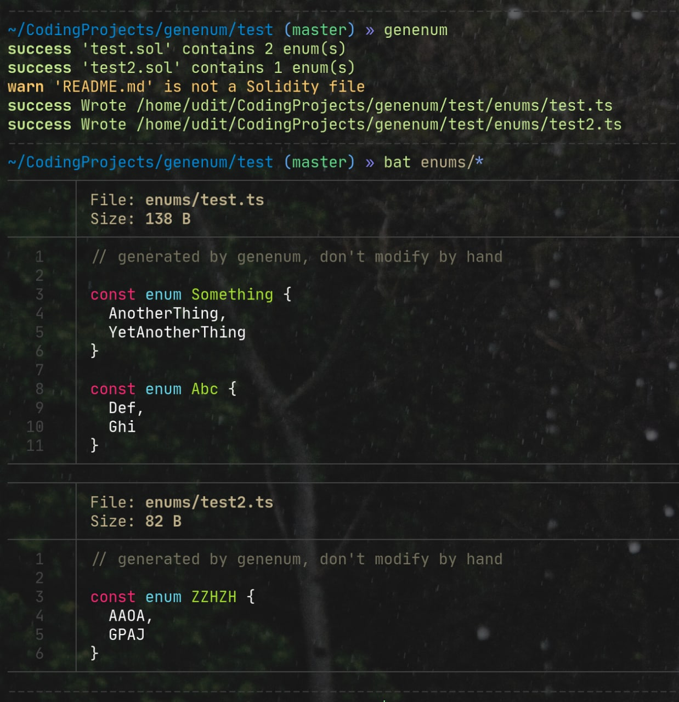

# GenEnum

`genenum` is a very simple tool that scans your solidity project directory and
extracts the enums into TypeScript files. Since TypeChain does not have this
functionality at this moment, this tool might save you the trouble of keeping
enums in sync manually.

